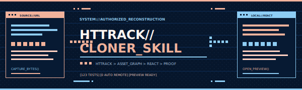
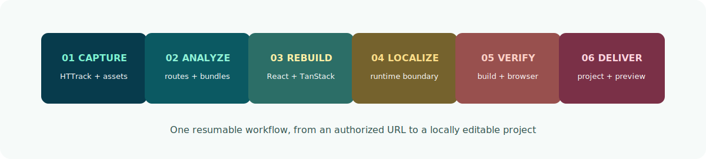

<p align="center">
  
</p>

<p align="center">
  <a href="README.md"><strong>English</strong></a> · <a href="README.zh-CN.md">简体中文</a>
</p>

<p align="center">
  <a href="https://github.com/Redux0223/httrack-cloner-skill/actions/workflows/ci.yml"></a>
  <a href="LICENSE"></a>
  
  
  
  
</p>

<p align="center">
  <strong>Give a coding agent an authorized URL. Get an editable local React project and an opened browser preview.</strong>
</p>

`httrack-cloner-skill` is a self-contained agent Skill for reconstructing authorized websites as local **React + TypeScript + TanStack Router** projects. It captures deployed files with HTTrack, recovers runtime assets, converts captured pages into typed routes, removes automatic external runtime requests, builds the result, runs browser diagnostics, and opens the local preview.

It is designed for coding agents, not as a hosted scraping service. The full SOP, scripts, references, validation loop, and repair workflow live in this repository.

> [!IMPORTANT]
> Use this project only for websites and assets you are authorized to capture, modify, and redistribute. The generated authorization inventory is technical evidence, not legal advice.

## Why this project

HTTrack is good at downloading what it can discover, but modern sites frequently depend on:

- dynamically imported chunks and runtime-assembled asset paths;
- video, fonts, workers, WASM, WebGL shaders, models, and texture formats;
- imperative bootstraps that expect a browser lifecycle;
- client-side routes that do not map cleanly to downloaded files;
- remote services and trackers that should not survive in a local project.

This Skill turns that raw mirror into a structured, resumable engineering workflow.

## What it does

| Stage | Output |
| --- | --- |
| Capture | Host-scoped HTTrack mirror and hashed asset inventory |
| Analyze | Routes, scripts, behavior contracts, runtime assets, and bootstrap evidence |
| Reconstruct | React 19, TypeScript, Vite, and TanStack Router file routes |
| Localize | Local assets and an automatic-request network boundary |
| Verify | Typecheck, production build, route probes, browser proof, and diagnostics |
| Deliver | A clean project directory and an opened loopback preview |

<p align="center">
  
</p>

## Quick start

### 1. Install the Skill

```bash
git clone https://github.com/Redux0223/httrack-cloner-skill.git
cd httrack-cloner-skill
npm ci --prefix scripts
```

Link or copy the repository into your agent's Skill directory:

```bash
mkdir -p ~/.codex/skills
ln -s "$(pwd)" ~/.codex/skills/httrack-cloner-skill
```

### 2. Give the agent a URL

```text
Use $httrack-cloner-skill on https://example.com/
```

The URL is the complete invocation. A compatible coding agent should allocate a fresh run, continue through repair loops, build the project, and open the preview without asking for a work directory.

### 3. Run the deterministic entry point directly

```bash
node scripts/run-url.mjs \
  --url "https://example.com/" \
  --authorized \
  --depth 3
```

The command prints:

```text
Fresh run: /absolute/path/to/clone-runs/example.com-TIMESTAMP-ID
Project: /absolute/path/to/clone-runs/example.com-TIMESTAMP-ID/react
```

If the workflow enters `REPAIR_LOOP`, resume the same run:

```bash
node scripts/run-url.mjs --resume "/absolute/path/to/run"
```

## Requirements

- Node.js 20 or newer
- npm
- HTTrack available on `PATH`
- Chromium dependencies for Playwright proof runs
- Network access to the authorized source during capture
- Enough disk space for media, models, textures, and clean reproduction

Install HTTrack:

```bash
# macOS
brew install httrack

# Ubuntu / Debian
sudo apt-get update && sudo apt-get install -y httrack
```

Install the proof browser when needed:

```bash
npx --prefix scripts playwright install chromium
```

## Output structure

```text
clone-runs/<host>-<timestamp>-<id>/
├── mirror/                  # captured source and asset inventory
├── react/                   # editable deliverable
│   ├── src/pages/           # generated React pages
│   ├── src/routes/          # TanStack Router file routes
│   ├── src/runtime/         # local network and runtime adapters
│   ├── public/              # captured local assets
│   ├── reports/             # conversion and delivery evidence
│   └── package.json
├── proof/                   # source/local browser evidence
└── .cloner/                 # state, trace, invocation, and repair data
```

## Production-first delivery model

The workflow separates **project delivery** from **parity diagnostics**:

- Build, typecheck, local assets, automatic network requests, clean reproduction, route probes, and preview opening are delivery signals.
- Text, geometry, animation phase, title, and screenshot differences are recorded as parity diagnostics.
- A captured local runtime may remain behind a React mount for complex WebGL or production bundles. That result is reported as a **React adapter**, not falsely labeled a pure React rewrite.
- `proofPassed` and `proofDiagnosticAccepted` remain separate in the delivery manifest.

This avoids two bad outcomes: blocking a usable local project because a proof tool timed out, or claiming pixel-perfect parity when evidence says otherwise.

## Generated reports

Key reports include:

| Report | Purpose |
| --- | --- |
| `conversion-manifest.json` | Routes, runtime classification, removed references, and conversion mode |
| `authorization-manifest.json` | Captured files, hashes, notices, and authorization evidence |
| `no-external-runtime.json` | Automatic request and remote literal analysis |
| `local-assets.json` | Browser-reachable local asset resolution |
| `architecture-verification.json` | Router, React ownership, bootstrap, and engine diagnostics |
| `proof-summary.json` | Desktop/mobile source-local comparisons and action traces |
| `reproducibility.json` | Clean install, build, preview, and HTTP route probes |
| `delivery-manifest.json` | Final project, preview, browser-open, proof, and delivery status |

## Tested behavior

The repository contains **123 automated tests** covering:

- HTTrack capture and authorization enforcement;
- dynamic assets, retries, timeouts, and content signatures;
- React-safe HTML attributes and TanStack route generation;
- 404 asset responses masquerading as HTML pages;
- automatic external request sanitization;
- WebGL/canvas and runtime adapter contracts;
- scroll-lock, pointer, hold, media, and mobile proof actions;
- production-first proof semantics and manifest integrity;
- clean reproduction and browser preview delivery.

Real-world validation has been performed against animation-heavy, media-heavy, multi-route, and WebGL-style sites. Captured website code and assets are intentionally not included in this repository.

## Repository layout

```text
.
├── SKILL.md                 # autonomous agent SOP
├── agents/openai.yaml       # Skill UI metadata and default prompt
├── scripts/                 # deterministic capture, conversion, proof, and delivery tools
├── references/              # detailed migration and verification guidance
├── tests/                   # 123 Node test cases and local fixtures
├── docs/assets/             # repository-owned SVG artwork
└── .github/workflows/       # CI
```

## Safety and compliance

- The CLI requires explicit `--authorized` attestation.
- Capture is host-scoped by default.
- Credentials and known tracker patterns are removed or reported.
- Automatic external runtime requests are blocked unless explicitly localized.
- Authorization reports do not grant rights and do not replace legal review.
- Do not use this project to bypass authentication, CAPTCHAs, DRM, paywalls, access controls, or website terms.

See [SECURITY.md](SECURITY.md) for vulnerability reporting.

## Known limitations

- Minified production bundles cannot always become idiomatic hand-written React automatically.
- Complex canvas/WebGL sites may initially retain a sanitized local runtime adapter.
- Live APIs need explicit deterministic local behavior or an unavailable-state implementation.
- Visual proof can detect mismatches; it cannot automatically resolve every design or animation difference.
- HTTrack cannot capture bytes that are inaccessible, authenticated, DRM-protected, or generated only by unavailable services.

## Development

```bash
npm ci --prefix scripts
npm test
```

Run the release checks:

```bash
npm run validate
```

The CI workflow installs HTTrack and Chromium, validates the Skill metadata, and runs the complete test suite.

## Contributing

Bug reports, general capture fixtures, runtime adapters, and verifier improvements are welcome. Read [CONTRIBUTING.md](CONTRIBUTING.md) before opening a pull request.

Please do not submit copyrighted website captures, private credentials, production cookies, or third-party media as fixtures.

## License

The Skill implementation is released under the [MIT License](LICENSE). Generated projects and captured source assets retain their original ownership and licensing conditions.

---

<p align="center">
  Built for coding agents that need to finish the local project, not stop at a scrape report.
</p>
